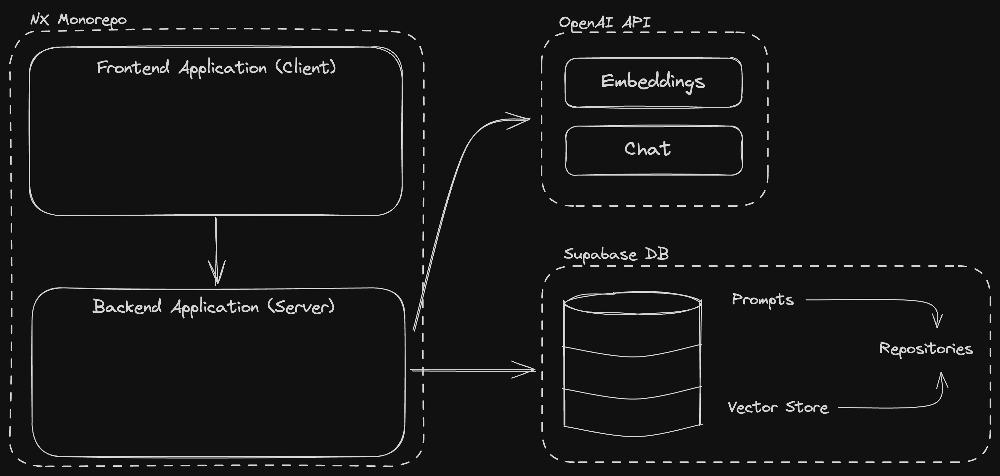

# Proposal: Repo Analysis Chatbot

## Executive Summary

The Repo Analysis Chatbot is an innovative application designed to revolutionize the way developers interact with and understand codebases on GitHub. By leveraging advanced natural language processing and machine learning techniques, this chatbot simplifies the complex task of code analysis, providing real-time, conversational insights into any repository. With its unique features and user-friendly interface, the Repo Analysis Chatbot aims to enhance developer productivity, facilitate collaboration, and streamline the process of understanding and navigating codebases.

## Problem Statement

Developers often face significant challenges when trying to understand and navigate complex codebases on GitHub. Tasks such as figuring out how to use a new library, understanding the purpose of a codebase, identifying the technologies used, and pinpointing weaknesses and areas for improvement can be time-consuming and require extensive manual effort. These challenges hinder developers' productivity and efficiency, leading to delays in project development and potential code quality issues.

## Solution

The Repo Analysis Chatbot addresses these challenges by providing a powerful and intuitive solution for code analysis. By leveraging Retrieval-Augmented Generation (RAG) and the OpenAI Embeddings API, the chatbot ingests data from specified GitHub repositories, transforms the raw code and documentation into a structured format, and stores it in a vector database. This enables the chatbot to efficiently retrieve relevant information when responding to user queries, ensuring accurate and contextually relevant answers.

Key features and functionalities of the Repo Analysis Chatbot include:

1. Natural Language Interaction: Users can ask questions and receive insights about a codebase using natural language, making it easy to obtain the information they need.
2. Social and Cooperative Feature: The chatbot fosters a sense of community and collaboration by allowing users to access and contribute to a shared knowledge base of analyzed repositories.
3. Repository Marketplace: Users can browse and select from a wide range of pre-scanned repositories, facilitating discovery and encouraging user engagement.
4. Predefined Prompts and Social Ranking: The chatbot offers well-tested prompts and allows users to upvote prompts based on answer quality, ensuring users can obtain the most effective answers.

The Repo Analysis Chatbot differentiates itself from existing solutions by providing a cost-effective, per-use pricing model (via API Key) and the ability to answer questions regarding all repository files, unlike LLM models with outdated data or GitHub Copilot, which requires an expensive annual subscription and has limited file analysis capabilities.

## Target Market

The primary target audience for the Repo Analysis Chatbot includes individual developers, development teams, and companies. The chatbot caters to the needs of developers across various industries and programming languages, offering them an unparalleled opportunity to dive deep into the intricacies of their code, uncover insights, and gain a holistic understanding of the codebase with minimal effort.

The potential market for this product is vast, as the demand for efficient code analysis tools continues to grow with the increasing complexity of codebases. The Repo Analysis Chatbot is well-positioned to capture a significant share of this market by providing a unique and valuable solution that addresses the pain points of developers worldwide.

## Technical Architecture

The Repo Analysis Chatbot is built using a modern and scalable tech stack, consisting of the following key components:

- Frontend: TypeScript, React
- Backend: TypeScript, Node.js, NestJS
- Database: Supabase DB (for storing repository data, embedded vectors, prompts)
- APIs: OpenAI API (for generating embeddings and powering the language model)

The chatbot follows a client-server architecture, with the frontend application communicating with the backend application through API calls. The backend application interacts with the OpenAI API for generating embeddings and responses, while also utilizing the Supabase DB for storing and retrieving data.

Two key services within the backend application are:

1. Code Analyzer Service: Responsible for scanning repositories, embedding files using the OpenAI Embeddings API, and storing the embedded vectors in the Supabase vector store.
2. Chat Service: Retrieves relevant information from the vector store based on user queries and generates responses using the RAG pattern and Langchain framework.

The RAG (Retrieval-Augmented Generation) pattern, employed in the Chat Service, enables the chatbot to retrieve relevant information from the vector store and augment the language model's knowledge during response generation. The Langchain framework facilitates the integration of the RAG pattern and the interaction with the OpenAI API.

The technical architecture of the Repo Analysis Chatbot is designed with scalability, security, and performance in mind. The use of modern technologies and frameworks ensures that the application can handle a large number of users and repositories while maintaining optimal performance and data integrity.

## Conclusion

The Repo Analysis Chatbot is a game-changing application that empowers developers to efficiently analyze and understand code repositories, enhancing productivity and collaboration. By leveraging cutting-edge technologies and innovative features, this chatbot addresses the critical challenges faced by developers when navigating complex codebases.

With its user-friendly interface, social and cooperative features, and cost-effective pricing model, the Repo Analysis Chatbot is poised to revolutionize the way developers interact with code. By investing in this project, stakeholders and investors have the opportunity to support a transformative solution that has the potential to significantly impact the software development industry.

We invite you to join us in bringing the Repo Analysis Chatbot to life and unlocking its full potential. Together, we can empower developers worldwide and drive innovation in the field of code analysis.
